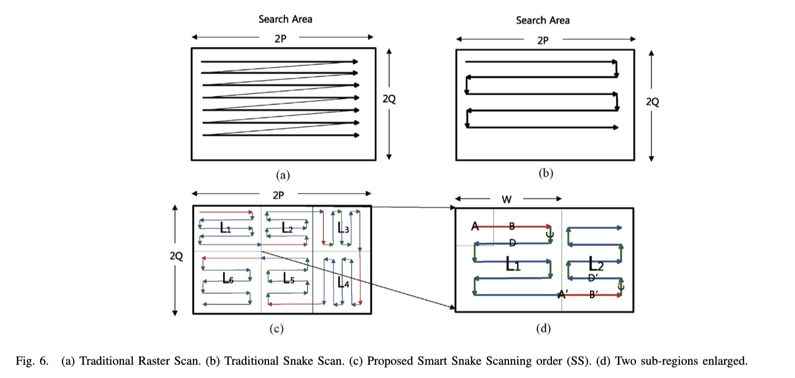

# Galvanometer Scanning
All plot function to plot the scan route of samples.
All code about a galvanomirror scanning, ``route planning, sampling, data analysis and feedback control.

Reform the code blocks. 
1. We can specify the start and end points. 
2. Using the pre-processed samples sequence to further solve the TSP problem.
3. The pre-processed method includes X, Y axis based process.

We have 3 kind of scanning routes planning algorithms,
which includes ortools based solver, 2-opt solver, basic sort algorithm.
Besides, we can specify the start and end points of the route planning algorithm.

We have Snake scan, Raster scan, and other scan based algorithm.

Now, we add some plot function, which can plot the samples-FPS, samples-Speed, samples-scan_time comparison of our 4 
methods. Include grid-scanning, 2opt scanning, google scanning, defined start/end points scanning.

### 2021-05-12
Add some basic functions, include Number of samples vs scanning speed.
Like NumOfSamples vs Average routes, NumOfSamples vs FPS, NumOfSamples vs Average Scanning time, 
and NumOfSamples vs Total Scanning Time.
Reform the code.

### 2021-11-17
Add some simulations of total scanning numbers according to different steps.
E.g., Scanning Windows (224x224), half the object's width as step length (224-80/2), full width of object as step length (224-80).

